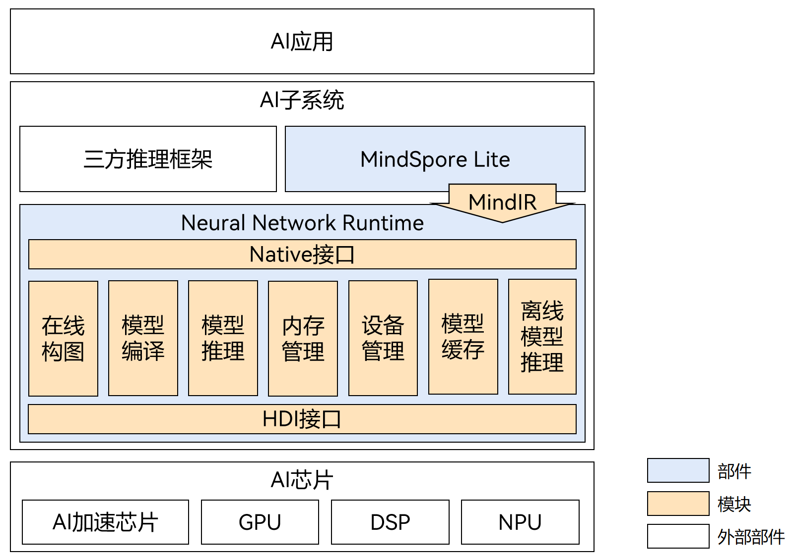

# Neural Network Runtime

Neural Network Runtime（神经网络运行时）是一套面向AI领域的运行时部件，适配上层AI推理引擎和底层加速芯片，为端侧AI推理引擎提供硬件加速的计算能力。

## 基本概念

在开发前，需要先了解以下概念，以便更好地理解全文内容：

- Native API：Openharmony 面向应用开发者的C语言接口。
- HDI：Hardware Device Interface，硬件设备接口，是OpenHarmony中系统组件与芯片组件通信的接口。关于更多HDI的细节，请浏览[驱动子系统](https://gitee.com/openharmony/docs/blob/master/zh-cn/readme/%E9%A9%B1%E5%8A%A8%E5%AD%90%E7%B3%BB%E7%BB%9F.md)。

## 运作机制

**图1** Neural Network Runtime架构图

如图1所示，在OpenHarmony系统上，AI应用通常要经过AI推理引擎和Neural Network Runtime才能对接底层芯片驱动，进而加速推理计算。Neural Network Runtime和芯片驱动直接通过HDI接口交互，Neural Network Runtime将模型和数据传递给芯片驱动，通过HDI接口在加速芯片上执行推理计算，计算结果通过Neural Network Runtime、AI推理引擎逐层返回至AI应用。

通常，AI应用、AI推理引擎、Neural Network Runtime处在同一个进程下，芯片驱动运行在另一个进程下，两者之间需要借助进程间通信（IPC）传递模型和计算数据。Neural Network Runtime根据HDI接口实现了HDI客户端，相应的，芯片厂商需要根据HDI接口实现并开放HDI服务。

架构图中每层功能简单阐述如下：
- AI应用：借助AI模型，提供丰富的应用能力，如：图像分类、人脸识别、文字识别等。
- AI推理引擎：为AI应用提供模型搭建、模型优化、推理计算的能力。
- Neural Network Runtime：作为AI推理引擎和底层加速芯片的桥梁，它开放了标准统一的HDI接口，不同的芯片都可以通过HDI接口接入Neural Network Runtime。
- HDI服务端：HDI服务端接收Neural Network Runtime传入的模型，将模型转换为加速芯片驱动所使用模型格式，并调用芯片驱动的接口执行计算。
- 加速芯片：加速芯片通常能够加速AI模型或者模型中部分算子的计算，提供优于CPU的性能。