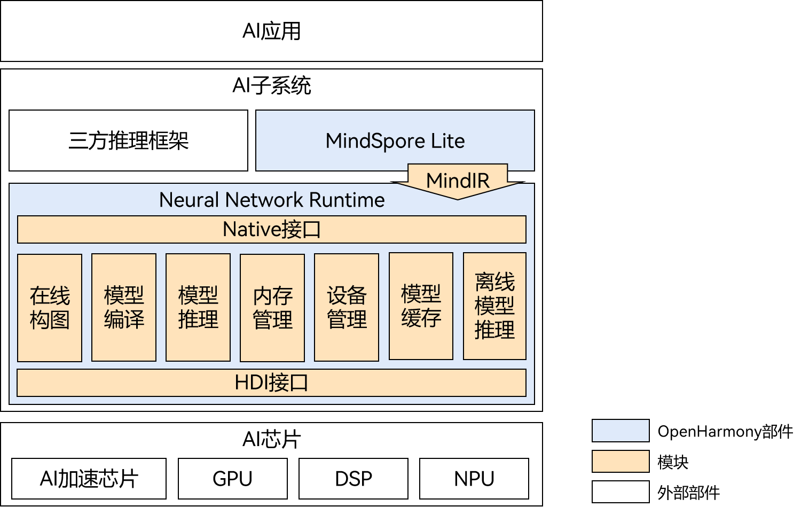

# Neural Network Runtime

## 简介

Neural Network Runtime（NNRt, 神经网络运行时）是面向AI领域的跨芯片推理计算运行时，作为中间桥梁连通上层AI推理框架和底层加速芯片，实现AI模型的跨芯片推理计算。

如图1所示，NNRt开放北向Native接口供AI推理框架接入，当前NNRt对接了系统内置的[MindSpore Lite](https://gitee.com/openharmony/third_party_mindspore)推理框架。同时NNRt开放南向HDI接口，供端侧AI加速芯片（如NPU、DSP等）接入OpenHarmony硬件生态。AI应用通过AI推理框架和NNRt能直接使用底层芯片加速推理计算。

Neural Network Runtime与MindSpore Lite使用MindIR统一模型的中间表达，减少中间过程不必要的模型转换，使得模型传递更加高效。

通常，AI应用、AI推理引擎、Neural Network Runtime处在同一个进程下，芯片驱动运行在另一个进程下，两者之间需要借助进程间通信（IPC）传递模型和计算数据。Neural Network Runtime根据HDI接口实现了HDI客户端，相应的，芯片厂商需要根据HDI接口实现并开放HDI服务。

**图1** Neural Network Runtime架构图


## 目录

```text
/foundation/ai/neural_network_runtime
├── common                         # 公共功能
├── figures                        # README引用的图片目录
├── example                        # 开发样例目录
│   ├── deep_learning_framework    # 应用/推理框架开发样例存放目录
│   └── drivers                    # 设备驱动开发样例存放目录
├── frameworks
│   └── native                     # 框架代码存放目录
│       └── ops                    # 算子头文件和实现存放目录
├── interfaces                     # 接口存放目录
│   ├── innerkits                  # 系统内部接口文件存放目录
│   └── kits                       # 对外开放接口文件存放目录 
└── test                           # 测试用例存放目录
    ├── system_test                # 系统测试用例存放目录
    └── unittest                   # 单元测试用例存放目录
```

## 编译构建

在OpenHarmony源码根目录下，调用以下指令，单独编译Neural Network Runtime。
```shell
./build.sh --product-name rk3568 --ccache --build-target neural_network_runtime --jobs 4
```
> **说明：** 
--product-name：产品名称，例如Hi3516DV300、rk3568等。
--ccache：编译时使用缓存功能。
--build-target: 编译的部件名称。
--jobs：编译的线程数，可加速编译。

## 说明

### 接口说明

Native接口文档请参考：[Native接口](https://gitee.com/openharmony-sig/interface_native_header/pulls/182)。

HDI接口文档请参考：[HDI接口](https://gitee.com/openharmony-sig/interface_native_header/pulls/179)。

### 使用说明

- AI推理引擎/应用开发请参考：[Neural Network Runtime应用开发指导](./neural-network-runtime-guidelines.md)。
- AI加速芯片驱动/设备开发请参考：[Neural Network Runtime设备开发指导](./example/drivers/README_zh.md)。

## 相关仓

- [**neural_network_runtime**](https://gitee.com/openharmony-sig/neural_network_runtime)
- [third_party_mindspore](https://gitee.com/openharmony/third_party_mindspore)
