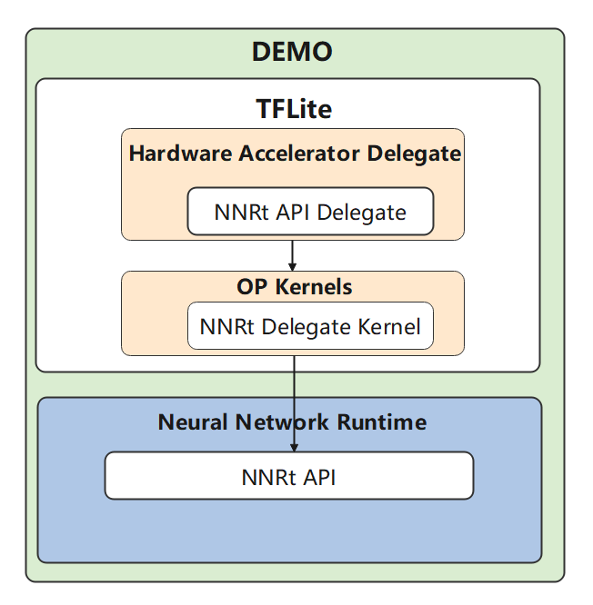

# Tensorflow Lite 接入NNRt Delegate Demo开发指南

## 概述

### 功能简介
- 神经网络运行时部件（NNRt）是跨设备的AI运行时框架，作为端侧推理框架和专用加速芯片的中间桥梁，为端侧推理框架提供了统一的Native接口；
- 本demo旨在介绍上层AI业务如何利用NNRt在专有芯片上加速推理，使能OpenHarmony社区生态；
- 本demo根据用户输入参数（模型、标签、模型输入shape、循环浮点推理次数、是否允许动态尺寸推理、以及是否打印结果等）完成标签分类模型推理，用户可通过打印信息观察在不同条件下的模型推理性能、精度等KIP。

### 基本概念
在开发前，开发者需要先了解以下概念，以便更好地理解全文内容:
- NNRt: Neural Network Runtime，神经网络运行时，是本指导主要介绍的部件。
- OHOS：OpenHarmony Operating System，开源鸿蒙操作系统。

### 约束与限制
- 系统版本：OpenHarmonyOS 3.2及以上
- 开发环境：Ubuntu 18.04及以上
- 接入设备：OpenHarmony定义的标准设备
- 其他开发依赖:
    - tensorflow-lite.so及其依赖库，目前完成在tensorflow lite 2.6版本上的测试;
    - NNRt库libneural_network_runtime.z.so;
    - TensorFlow Lite头文件：https://github.com/tensorflow/tensorflow/tree/master/tensorflow/lite;
    - mobilenetv2.tflite模型(https://storage.googleapis.com/mobilenet_v2/checkpoints/mobilenet_v2_1.4_224.tgz);
    - 标签文件labels.txt;
    - 测试图片grace_hopper.bmp;

### 运作机制
<div align=center></div>

  - 用户调用TFLite的BuildFromFile接口完成初始构图；
  - 用户设置自定义的参数options，应用于创建NnrtDelegate；
  - 用户创建DelegateProviders,并调用DelegateProviders的CreateAllRankedDelegates接口创建NnrtDelegate，创建NnrtDelegate过程中dlopen打开NNRt的动态库，并加载API，返回delegate；
  - 用户调用ModifyGraphWithDelegate接口完成Node替换，其中该步分四个步骤；
    - Initalize初始化NnrtDelegate;
    - 判断图中各node是否支持NnrtDelegate，返回支持的node集合；
    - 调用TFLiteRegistration注册NnrtDelegate，并初始化init, prepare, invoke成员函数指针，指向delegateKernel的Init, Prepare和run函数方法；
    - 替换TensorFlow Delegate的node为已注册的NNrt delegate kernel, 并调用Init完成构图步骤；
  - 用户调用AllocateTensors，完成内存分配和图编译，其中支持delegate的node会转到delegateKernel的prepare完成编译，不支持delegate的会调用原有tflite node的prepare编译；
  - 用户调用Invoke完成图执行;

### 开发流程
<div align=center></div>

### 开发步骤
本节主要描述NNRt接入TFLite的TFLite-delegate代理机制，重点对TFLite调用delegate的流程和delegate对接NNRt的方式进行了介绍。
TensorFlow Lite Delegate有两个基类DelegateProvider、TfLiteDelegate, 本节主要描述继承这两个基类得到子类NnrtDelegate和NnrtDelegateProvider。

本demo主要文件目录结构如下图：
```text
.
├── CMakeLists.txt
├── delegates
│   └── nnrt_delegate
│       ├── CMakeLists.txt
│       ├── nnrt_delegate.cpp
│       ├── nnrt_delegate.h
│       ├── nnrt_delegate_kernel.cpp
│       ├── nnrt_delegate_kernel.h
│       ├── nnrt_delegate_provider.cpp
│       ├── nnrt_op_builder.cpp
│       ├── nnrt_op_builder.h
│       ├── nnrt_utils.cpp
│       ├── nnrt_utils.h
│       └── tensor_mapping.h
├── label_classify
│   ├── CMakeLists.txt
│   ├── label_classify.cpp
│   └── label_classify.h
├── nnrt
│   ├── CMakeLists.txt
│   ├── nnrt_implementation.cpp
│   └── nnrt_implementation.h
└── tools
    ├── bitmap_helpers.cpp
    ├── bitmap_helpers.h
    ├── get_topn.h
    ├── log.h
    ├── utils.cpp
    └── utils.h
```
1. 创建Tensorflow Lite NnrtDelegate类
    - Tensorflow Lite NNRt Delegate 使TensorFlow Lite模型能够运行在NNRt框架（https://gitee.com/openharmony/neural_network_runtime）上，这导致了在OHOS设备上更快的模型推理
    - nnrt_delegate依赖nnrt_delegate_kernel, nnrt_delegate_kernel（将支持替换的TensorFlow Lite模型中的operators替换成Nnrt中的operators）依赖nnrt_op_builder（给每个operators设置输入输出tensor和operation属性），完成nnrt_delegate的自定义。


2. 创建NnrtDelegateProvider
    - NnrtDelegateProvider依赖nnrt_implementation(用于加载libneural_network_runtime.z.so中的Api)和nnrt_delegate(用于创建子类NnrtDelegate对象)，完成与TFLite的对接；

    - 注册NnrtDelegateProvider
      ```cpp
        REGISTER_DELEGATE_PROVIDER(NnrtDelegateProvider);
      ```

    - 创建CreateTfLiteDelegate主要有以下几步
      ```cpp
      NnrtDelegate::Options options;

      const auto* nnrtImpl = NnrtImplementation();
      if (!nnrtImpl->nnrtExists) {
          TFLITE_LOG(WARN) << "NNRT acceleration is unsupported on this platform.";
          return delegate;
      }

      Interpreter::TfLiteDelegatePtr TfLiteDelegatePtr(new (std::nothrow) NnrtDelegate(nnrtImpl, options),
          [](TfLiteDelegate* delegate) { delete reinterpret_cast<NnrtDelegate*>(delegate); });
      ```

3. label_classify.cpp中加载Nnrt_Delegate
    ```cpp
    interpreter->ModifyGraphWithDelegate(std::move(delegate.delegate))
    ```

### 调测命令
1. 编译生成Tensorflow Lite库及其依赖库
    请参考Tensorflow Lite交叉编译指南（https://www.tensorflow.org/lite/guide/build_cmake_arm）, 同时在```tensorflow/lite/CMakeLists.txt```中增加以下内容：
    ```text
    # TODO: TFLite External Delegate
    list(APPEND TFLITE_EXTERNAL_DELEGATE_SRC
        ${TFLITE_SOURCE_DIR}/tools/delegates/delegate_provider.cc
        # ${TFLITE_SOURCE_DIR}/tools/delegates/external_delegate_provider.cc
        ${TFLITE_SOURCE_DIR}/tools/tool_params.cc
        ${TFLITE_SOURCE_DIR}/tools/command_line_flags.cc
    )
    ```
    ```text
    target_link_libraries(tensorflow-lite
      PUBLIC
        Eigen3::Eigen
        NEON_2_SSE
        absl::flags
        absl::hash
        absl::status
        absl::strings
        absl::synchronization
        absl::variant
        farmhash
        fft2d_fftsg2d
        flatbuffers
        gemmlowp
        ruy
        ${CMAKE_DL_LIBS}
        ${TFLITE_TARGET_DEPENDENCIES}
    )
    ```
2. 编译生成NNRt库libneural_network_runtime.z.so
    请参考编译指导（https://gitee.com/openharmony/build），编译命令如下
    ```shell
       ./build.sh --product-name rk3568 –ccache --jobs=16 --build-target=neural_network_runtime
    ```
3. 用cmake编译北向demo
    - 将TensorFlow Lite头文件(https://github.com/tensorflow/tensorflow/tree/master/tensorflow/lite)和编译生成的TensorFlow Lite库，分别放在```deep_learning_framework/lib_3rd_nnrt_tflite/include/tensorflow/lite/```和```deep_learning_framework/lib_3rd_nnrt_tflite/com/arm64-v8a/lib/```下；
    - 指定ohos的cmake, ohos.toolchain.cmake路径，在```foundation/ai/neural_network_runtime/example/cmake_build/build_ohos_tflite.sh```中替换以下两行;
      ```shell
      ./tool_chain/native/build-tools/cmake/bin/cmake \
      -DCMAKE_TOOLCHAIN_FILE=./tool_chain/native/cmake_build/cmake/ohos.toolchain.cmake \
      ```
    - 进入```foundation/ai/neural_network_runtime/example/cmake_build```:
        - 如果需要在arm32架构的CPU上运行:
          - 修改```tflite/CMakeLists.txt```
            ```text
            set(CMAKE_CXX_FLAGS "-pthread -fstack-protector-all -fPIC -D_FORTIFY_SOURCE=2 -march=armv7-a")
            ```
          - 执行编译命令
            ```shell
            bash build_ohos_tflite.sh armeabi-v7a
            ```
        - 如果需要在arm64架构的CPU上运行:
          - 修改```tflite/CMakeLists.txt```
            ```text
            set(CMAKE_CXX_FLAGS "-pthread -fstack-protector-all -fPIC -D_FORTIFY_SOURCE=2 -march=armv8-a")
            ```
          - 执行编译命令
            ```shell
            bash build_ohos_tflite.sh arm64-v8a
            ```
    - 在```example/deep_learning_framework/```目录下创建lib和output两个文件夹:
        ```shell
        mkdir lib output
        ```
    - 进入```foundation/ai/neural_network_runtime/example/cmake_build```, 执行链接命令:
        ```shell
        make
        ```
    - 北向demo成功编译完成后会在```deep_learning_framework/lib```生成libnnrt_delegate.so和libnnrt_implementation.so, 在```deep_learning_framework/output```下生成label_classify可执行文件，目录结构体如下所示。

      ```text
      deep_learning_framework
      ├── lib
      │   ├── libnnrt_delegate.so                 # 生成的TensorFlow Lite nnrt delegate库
      │   └── libnnrt_implementation.so           # 生成的nnrt在TensorFlow Lite中接口实现库
      └── output
          └── label_classify                      # 生成的可执行文件
      ```

4. 在开发板上运行北向demo
    - 将步骤1生成的libnnrt_implementation.so, libnnrt_delegate.so和可执行文件label_classify, libneural_network_runtime.z.so, tensorflow-lite.so及其依赖的库, mobilenetv2.tflite模型, 标签labels.txt, 测试图片grace_hopper.bmp推送到开发板上:
      ```shell
      # 假设上述待推送文件均放在push_files/文件夹下
      hdc_std file send push_files/ /data/demo/
      ```
    - 进入开发板，执行demo前需要添加环境变量，文件执行权限等:
      ```shell
      # 进入开发板
      hdc_std shell

      # 进入推送文件目录，并增加可执行文件权限
      cd /data/demo
      chmod +x ./label_classify

      # 添加环境变量
      export LD_LIBRARY_PATH=/data/demo:$LD_LIBRARY_PATH

      # 执行demo，-m tflite模型， -i 测试图片， -l 数据标签， -a 1表示使用nnrt, 0表示不使用nnrt推理，-z 1 表示打印输出张量大小的结果
      ./label_classify -m mobilenetv2.tflite -i grace_hopper.bmp -l labels.txt -a 1 -z 1
      ```

### 开发实例
完整[Demo实例](xxx, Demo暂时还在黄区代码仓，超链接需等Demo开源后补充)可以参考社区实现。
