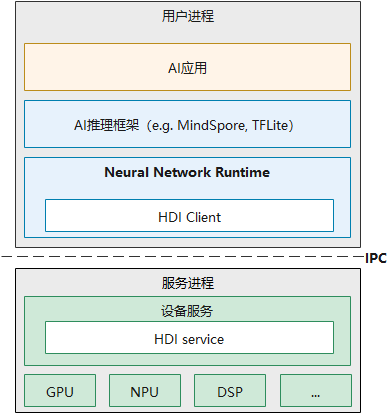
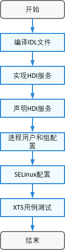

# NNRt开发指导

## NNRt开发概述

### 功能简介

神经网络运行时部件（NNRt）是跨设备的AI运行时框架，作为端侧推理框架和专用加速芯片的中间桥梁，为端侧推理框架提供了统一的Native接口，使能端侧推理框架在专有加速芯片上推理；为芯片厂商提供了统一的HDI接口，使能专有加速芯片接入OpenHarmony社区生态。

本文介绍芯片厂商如何在将专有加速芯片接入NNRt，接入OpenHarmony社区生态。

### 基本概念
在开发前，开发者需要先了解以下概念，以便更好地理解全文内容：

- NNRt：Neural Network Runtime，神经网络运行时，是本指导主要介绍的部件。
- OHOS：OpenHarmony Operating System，开源鸿蒙操作系统。
- HDI：Hardware Device Interface，硬件设备接口，是OHOS中系统组件与芯片组件通信的接口。
- IDL: Interface Description Language，接口描述语言，是HDI接口的语言格式。

### 约束与限制
- 系统版本：OpenHarmony 3.2及以上。
- 开发环境：Ubuntu 18.04及以上。
- 接入设备：OpenHarmony定义的标准设备。

### 运作机制
NNRt通过HDI接口实现与设备芯片的对接，由HDI接口实现跨进程通信。

**图1** NNRt架构图



整个架构主要分为三层，AI应用在应用层，AI推理框架和神经网络运行时在系统层，设备服务在芯片层。AI应用要在专用加速芯片上完成模型推理，需要经过AI推理框架和神经网络运行时才能调用到底层的芯片设备，而神经网络运行时就是负责适配底层各种芯片设备，它开放了标准统一的南向接口，众多的第三方芯片设备都可以通过HDI接口接入OHOS。

程序运行时，AI应用、AI推理框架、神经网络运行时都在同一个进程，底层设备服务在另一个进程，进程间是通过IPC的机制通信，神经网络运行时根据南向HDI接口实现了HDI Client，服务端也需要根据南向HDI接口实现HDI Service。

## NNRt开发指导

### 场景介绍
下文以rk3568芯片为例，展示rk3568 CPU如何通过HDI接口接入NNRt，并完成AI模型推理。

### 开发流程
适配操作的整体流程如下：

**图2** NNRt适配流程



### 开发步骤
开发者具体可通过以下步骤在芯片侧对接NNRt：
1. 开源社区下载OpenHarmony的代码，编译drivers_interface部件，生成HDI接口的头文件。
    - [下载源码](../get-code/sourcecode-acquire.md)。
    - 编译接口IDL文件。
        ```shell
        ./build.sh --product-name rk3568 –ccache --target-cpu arm64 --build-target=drivers_interface_nnrt
        ```

        --target-cpu arm64：是64位编译选项，若编译32位，则不需添加--target-cpu arm64

        编译之后，可以在```out/rk3568/gen/drivers/interface/nnrt```目录下找到生成的头文件，默认生成C++头文件，若需要生成C头文件，则修改```drivers/interface/nnrt/v1_0/BUILD.gn```文件中的language。
        ```shell
        language = "c"
        ```

        生成头文件目录如下所示：
        ```text
        out/rk3568/gen/drivers/interface/nnrt
        └── v1_0
            ├── drivers_interface_nnrt__libnnrt_proxy_1.0_external_deps_temp.json
            ├── drivers_interface_nnrt__libnnrt_stub_1.0_external_deps_temp.json
            ├── innrt_device.h                        # 设备接口头文件
            ├── iprepared_model.h                     # 编译AI模型对象头文件
            ├── libnnrt_proxy_1.0__notice.d
            ├── libnnrt_stub_1.0__notice.d
            ├── model_types.cpp                       # AI模型结构定义实现文件
            ├── model_types.h                         # AI模型结构定义头文件
            ├── nnrt_device_driver.cpp                # 设备驱动实现参考样例
            ├── nnrt_device_proxy.cpp
            ├── nnrt_device_proxy.h
            ├── nnrt_device_service.cpp               # 设备服务端实现参考样例
            ├── nnrt_device_service.h                 # 设备服务端头文件
            ├── nnrt_device_stub.cpp
            ├── nnrt_device_stub.h
            ├── nnrt_types.cpp                        # 数据类型定义实现文件
            ├── nnrt_types.h                          # 数据类型定义头文件
            ├── node_attr_types.cpp                   # AI模型算子属性定义实现文件
            ├── node_attr_types.h                     # AI模型算子属性定义
            ├── prepared_model_proxy.cpp
            ├── prepared_model_proxy.h
            ├── prepared_model_service.cpp            # 编译AI模型对象服务端实现参考样例
            ├── prepared_model_service.h              # 编译AI模型对象服务端头文件
            ├── prepared_model_stub.cpp
            └── prepared_model_stub.h
        ```

2. 实现HDI服务
    - 在drivers/peripheral目录下新建开发目录，用于HDI服务开发，开发目录结构如下所示。
        ```text
        drivers/peripheral/nnrt
        ├── BUILD.gn                                  # 代码编译脚本文件
        ├── bundle.json
        └── hdi_cpu_service                           # 自定义目录
            ├── BUILD.gn                              # 代码编译脚本文件
            ├── include
            │   ├── nnrt_device_service.h             # 设备服务端头文件
            │   ├── node_functions.h                  # 非必须，由具体实现决定
            │   ├── node_registry.h                   # 非必须，由具体实现决定
            │   └── prepared_model_service.h          # 编译AI模型对象服务端头文件
            └── src
                ├── nnrt_device_driver.cpp            # 设备驱动实现文件
                ├── nnrt_device_service.cpp           # 设备服务端实现文件
                ├── nnrt_device_stub.cpp              # 非必须，由具体实现决定
                ├── node_attr_types.cpp               # 非必须，由具体实现决定
                ├── node_functions.cpp                # 非必须，由具体实现决定
                ├── node_registry.cpp                 # 非必须，由具体实现决定
                └── prepared_model_service.cpp        # 编译AI模型对象服务端实现文件
        ```

    - 实现设备驱动，无特殊需求可直接使用步骤1中生成的nnrt_device_driver.cpp文件，否则根据具体驱动开发。
    - 实现服务接口，主要实现nnrt_device_service.cpp和prepared_model_service.cpp文件，接口定义可以参考```drivers/interface/nnrt```。

    - 编译驱动和服务实现为共享库。
    在```drivers/peripheral/nnrt/hdi_cpu_service/```下新建```BUILD.gn```文件，对驱动入口和服务实现编译为共享库。

    ```shell
    import("//build/ohos.gni")
    import("//drivers/hdf_core/adapter/uhdf2/uhdf.gni")

    ohos_shared_library("libnnrt_service_1.0") {
      include_dirs = []
      sources = [
        "src/nnrt_device_service.cpp",
        "src/prepared_model_service.cpp",
        "src/node_registry.cpp",
        "src/node_functions.cpp",
        "src/node_attr_types.cpp"
      ]
      public_deps = [ "//drivers/interface/nnrt/v1_0:nnrt_idl_headers" ]
      external_deps = [
        "hdf_core:libhdf_utils",
        "hiviewdfx_hilog_native:libhilog",
        "ipc:ipc_single",
        "c_utils:utils",
      ]

      install_images = [ chipset_base_dir ]
      subsystem_name = "hdf"
      part_name = "drivers_peripheral_nnrt"
    }

    ohos_shared_library("libnnrt_driver") {
      include_dirs = []
      sources = [ "src/nnr_device_driver.cpp" ]
      deps = [ "//drivers/peripheral/nnrt/hdi_cpu_service:libnnrt_service_1.0" ]

      external_deps = [
        "hdf_core:libhdf_host",
        "hdf_core:libhdf_ipc_adapter",
        "hdf_core:libhdf_utils",
        "hiviewdfx_hilog_native:libhilog",
        "ipc:ipc_single",
        "c_utils:utils",
      ]

      install_images = [ chipset_base_dir ]
      subsystem_name = "hdf"
      part_name = "drivers_peripheral_nnrt"
    }

    group("hdf_nnrt_service") {
      deps = [
        ":libnnrt_driver",
        ":libnnrt_service_1.0",
      ]
    }
    ```

    将```group("hdf_nnrt_service")```添加到```drivers/peripheral/nnrt/BUILD.gn```文件中
    ```shell
    if (defined(ohos_lite)) {
      group("nnrt_entry") {
        deps = [ ]
      }
    } else {
      group("nnrt_entry") {
        deps = [
          "./hdi_cpu_service:hdf_nnrt_service",
        ]
      }
    }
    ```

    新建```drivers/peripheral/nnrt/bundle.json```用于定义新增的```drivers_peripheral_nnrt```部件。
    ```json
    {
      "name": "drivers_peripheral_nnrt",
      "description": "Neural network runtime device driver",
      "version": "3.2",
      "license": "Apache License 2.0",
      "component": {
        "name": "drivers_peripheral_nnrt",
        "subsystem": "hdf",
        "syscap": [""],
        "adapter_system_type": ["standard"],
        "rom": "1024KB",
        "ram": "2048KB",
        "deps": {
          "components": [
            "ipc",
            "hdf_core",
            "hiviewdfx_hilog_native",
            "c_utils"
          ],
          "third_part": [
            "bounds_checking_function"
          ]
        },
        "build": {
          "sub_component": [
            "//drivers/peripheral/nnrt:nnrt_entry"
          ],
          "test": [
          ],
          "inner_kits": [
          ]
        }
      }
    }
    ```

3. 声明HDI服务
    在对应产品的uhdf hcs配置文件中声明用户态驱动与服务，本例中rk3568对应在```vendor/hihope/rk3568/hdf_config/uhdf/device_info.hcs```文件中新增如下配置:
    ```text
    nnrt :: host {
        hostName = "nnrt_host";
        priority = 50;
        uid = "";
        gid = "";
        caps = ["DAC_OVERRIDE", "DAC_READ_SEARCH"];
        nnrt_device :: device {
            device0 :: deviceNode {
                policy = 2;
                priority = 100;
                moduleName = "libnnrt_driver.z.so";
                serviceName = "nnrt_device_service";
            }
        }
    }
    ```
    注意：修改hcs文件后请删除out目录重新编译，才能生效。

4. 配置host进程用户和组
    对于新增host进程的场景，需要新增配置对应进程的用户ID和组ID。 进程的用户ID在文件```base/startup/init/services/etc/passwd```中配置，进程的组ID在文件```base/startup/init/services/etc/group```中配置。 
    ```text
    # 在base/startup/init/services/etc/passwd新增
    nnrt_host:x:3311:3311:::/bin/false

    # 在base/startup/init/services/etc/group新增
    nnrt_host:x:3311:
    ```
    完成上述所有配置后，全量编译版本后应该可以观察到新增host进程启动，也可以通过hilog输出检索新增的服务名称nnrt_interface_service观察到服务发布成功

5. SELinux配置
    OHOS已经开启SELinux特性，需要对新增的进程和服务配置相应的SELinux规则，用于运行host进程启动访问某些资源、发布HDI服务。对于调用者来说，也需要配置SELinux规则运行获取和调用某个HDI服务。

    在```base/security/selinux/sepolicy/ohos_policy/drivers/adapter/vendor/type.te```文件中配置nnrt_host进程安全上下文
    ```text
    # 新增
    type nnrt_host, hdfdomain, domain;
    ```

    由于SeLinux是白名单访问的权限机制，需要根据实际权限需求配置，将服务启动起来之后，通过以下dmesg命令可能查看avc告警，
    avc告警会给出缺少的权限，SeLinux的配置也可以参考[OpenHarmony SeLinux子系统的说明](https://gitee.com/openharmony/security_selinux/blob/master/README.md)
    ```shell
    hdc_std shell
    dmesg | grep nnrt
    ```

    新建nnrt_host.te配置文件，将权限配置到nnrt_host.te文件中
    ```shell
    # 创建nnrt文件夹
    mkdir base/security/selinux/sepolicy/ohos_policy/drivers/peripheral/nnrt

    # 创建vendor文件夹
    mkdir base/security/selinux/sepolicy/ohos_policy/drivers/peripheral/nnrt/vendor

    # 创建nnrt_host.te文件
    touch base/security/selinux/sepolicy/ohos_policy/drivers/peripheral/nnrt/vendor/nnrt_host.te
    ```

    然后再将所需的权限写入nnrt_host.te文件中，比如：
    ```text
    allow nnrt_host dev_hdf_kevent:chr_file { ioctl };
    allow nnrt_host hilog_param:file { read };
    allow nnrt_host sh:binder { transfer };
    allow nnrt_host dev_ashmem_file:chr_file { open };
    allow sh nnrt_host:fd { use };
    ```

6. 删除out目录编译整个系统
    ```shell
    ./build.sh --product-name rk3568 –ccache --jobs=4
    ```


### 调测验证
服务开发完成后，可以使用XTS用例验证基本功能和兼容性，开发者可通过以下步骤进行验证：
1. 开源社区下载[OpenHarmony代码](https://gitee.com/openharmony/docs/blob/master/zh-cn/device-dev/get-code/sourcecode-acquire.md)，相关用例在test/xts/hats/hdf/nnrt目录下。
2. 编译XTS用例。
```shell
cd test/xts/hats
./build.sh suite=hats system_size=standard --product-name rk3568
```
编译好的测试用例会输出到out/rk3568/suites/hats/testcases/HatsHdfNnrtFunctionTest


3. 将测试用例push到设备上。
```shell
# 将测试用例可执行文件推送到设备上，HatsHdfNnrtFunctionTest是测试用例可执行文件。
hdc_std file send out/rk3568/suites/hats/testcases/HatsHdfNnrtFunctionTest /data/local/tmp/

# 给测试用例可执行文件加上权限。
hdc_std shell "chmod +x /data/local/tmp/HatsHdfNnrtFunctionTest"

# 执行测试用例
hdc_std shell "/data/local/tmp/HatsHdfNnrtFunctionTest"
```

### 开发实例
完整[Demo实例](xxx, Demo暂时还在黄区代码仓，超链接需等Demo开源后补充)可以参考社区实现。

